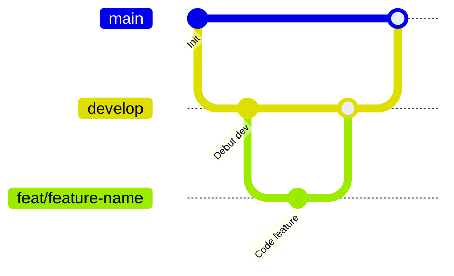

PoC Medhead - Service de gestion des lits d'urgence
==========

Ce PoC a pour objectif de démontrer la faisabilité d'un service de gestion des lits d'urgence pour les hôpitaux.
Il doit permettre à l'utilisateur de choisir une spécialité médicale, et de trouver l'hopital le plus proche qui a un lit disponible pour cette spécialité.


## Lancer le projet

### Avec docker compose (pour les tests)

Lancer tout le projet avec docker compose (base de données, api gateway, backend et frontend)
```bash
docker compose up -d
```

### Pour le développement

1. Lancer la base de données et l'api gateway avec docker compose
```bash
docker compose up -d database
docker compose up -d api-gateway
```

2. Lancer le backend
```bash
cd emergency-bed-service
./gradlew bootRun
```

3. Lancer le frontend
```bash
cd front-end
npm install
npm start # or `npm run dev`
```


## Documentation détaillée de chaque partie du projet

- [README Backend](./emergency-bed-service/README.md)

- [README Frontend](./front-end/README.md)


## Versionning


- Nommage des commits : [Conventional Commits](https://www.conventionalcommits.org/fr/v1.0.0-beta.3/)

```
<type>[optional scope]: <description>

[optional body]

[optional footer]
```

- Gestion des branches inspirée de [Gitflow](https://www.atlassian.com/fr/git/tutorials/comparing-workflows/gitflow-workflow)




## CI/CD

Pour la CI/CD on utilise Github Actions avec un workflow défini dans [.github/workflows/ci.yml](.github/workflows/ci.yml).

Il comporte 3 jobs principaux :
- **backend tests** (a chaque push) : lance les tests unitaires et d'intégration du backend
- **e2e tests** (sur main/develop) : lance les tests e2e avec Playwright en lançant tout le projet avec docker compose
- **stress tests** (sur main/develop) : lance les tests de stress avec JMeter en lançant tout le projet avec docker compose
