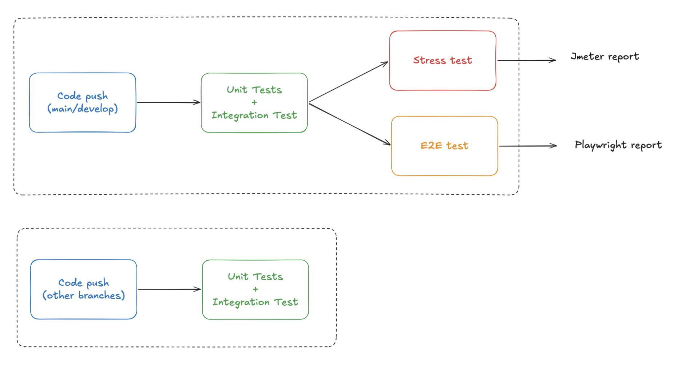

# CI

Pour la CI on utilise Github Actions avec un workflow défini dans [.github/workflows/ci.yml](.github/workflows/ci.yml).

Il comporte 3 jobs principaux :
- **backend tests** (a chaque push) : lance les tests unitaires et d'intégration du backend
- **e2e tests** (sur main/develop) : lance les tests e2e avec Playwright en lançant tout le projet avec docker compose
- **stress tests** (sur main/develop) : lance les tests de stress avec JMeter en lançant tout le projet avec docker compose

