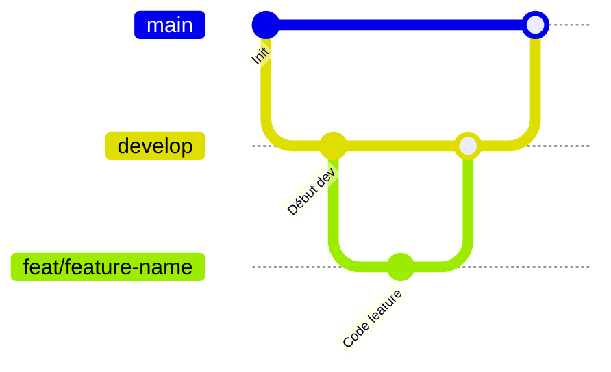

# Versionning


- Nommage des commits : [Conventional Commits](https://www.conventionalcommits.org/fr/v1.0.0-beta.3/)

```
<type>[optional scope]: <description>

[optional body]

[optional footer]
```

- Gestion des branches inspirée de [Gitflow](https://www.atlassian.com/fr/git/tutorials/comparing-workflows/gitflow-workflow)

